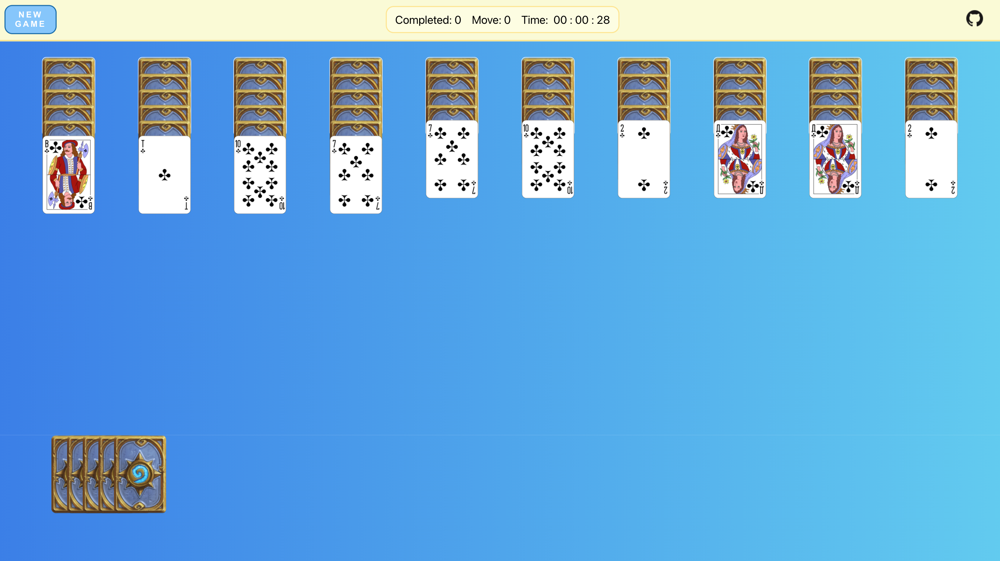
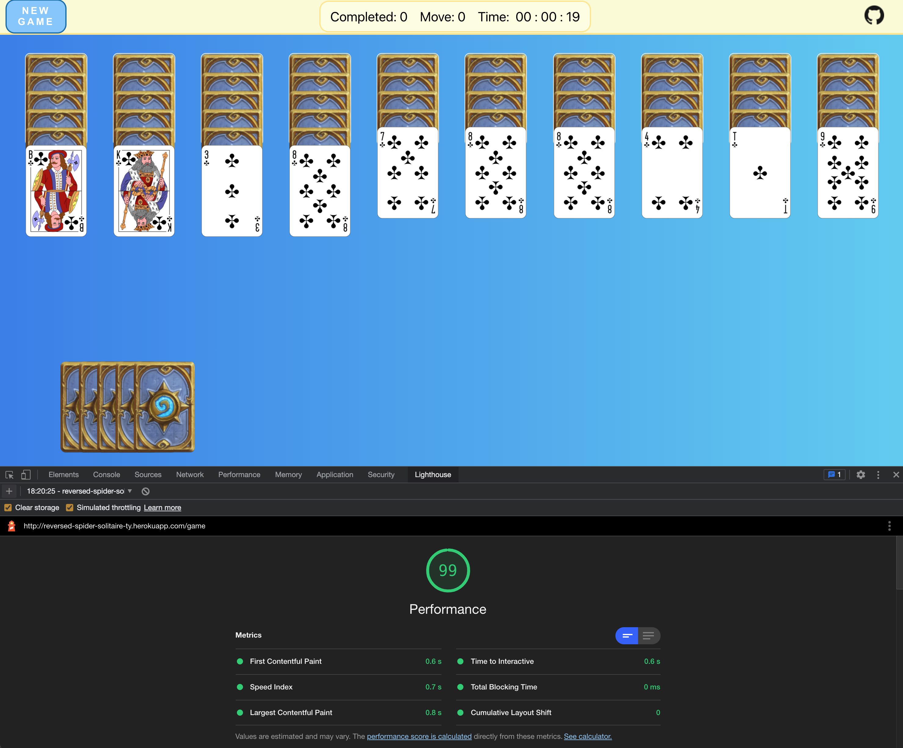

# REVERSED SPIDER SOLITAIRE FINAL PROJECT

This project is prepared as a capstone project for Trendyol Front End Bootcamp which is organised with the partnership of Kodluyoruz. The one suit spider solitaire game is developed by react.

You can via following link. [PLAY!](http://reversed-spider-solitaire-ty.herokuapp.com/)

## OVERVIEW


The game is one suit spider solitaire but the logic is vice versa which means the card series should be from A to K.

- Cards should be in series
- Single or cards in series can be moved
- Completing a serie A to K gives one point
- To be able to beat the game eight series should be completed
- There are five card stacks at the left bottom corner
- Each of them adds one open card to each row regardless the values of cards
- Local storage is used to store best timings

## PACKAGE DETAILS

- The project is based on ReactJS
- Cypress / Jest is used for testing
- It is deployed to Heroku where automatic deployment is active (CI/CD)
- React Router for routing
- Css module for styling

## INSTALLATION

```
git clone https://github.com/canberkonem/reversed-spider-solitaire.git
```

```
npm install

npm run start
```

## SCORE

The project is taking advantage of local storage to register game data.

Best ten completing time of the project is on display at records page.

## APP PERFORMANCE

The lighthouse test result is below.

### The testing conditions

- M1 2020 MACBOOK AIR
- 100 mbps connection



## E2E TEST

Execute following code to perform e2e tests made by using Cypress

```
npx cypress open
```
